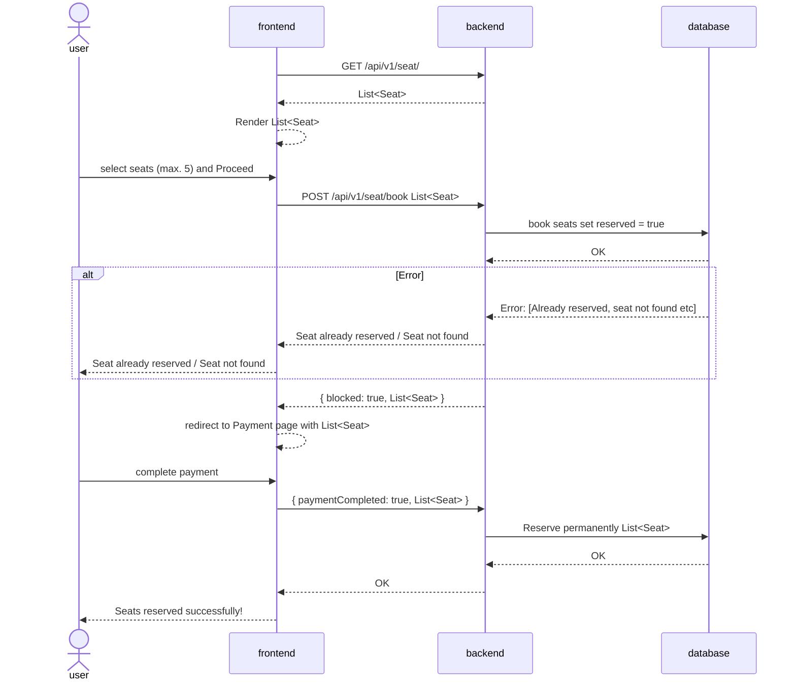
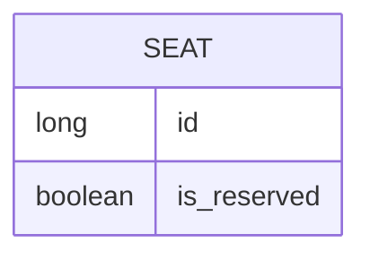

# seat-select-simulator
A web-based simulator that show how seat selection works in ticket booking systems such as BookMyShow, TicketMaster etc.

## Overview

- A person chooses to go to an event
- He/She tries to book a ticket of the event
- There is an arrangement of seats at the event
- The prices of those seats differ
- The position of those seats matter to the user
- Let's say the event is very popular, and millions of users try to book those seats at the same time
- How to handle the concurrency of such system?
- The system has to be available, scalable, reliable

## DB design

